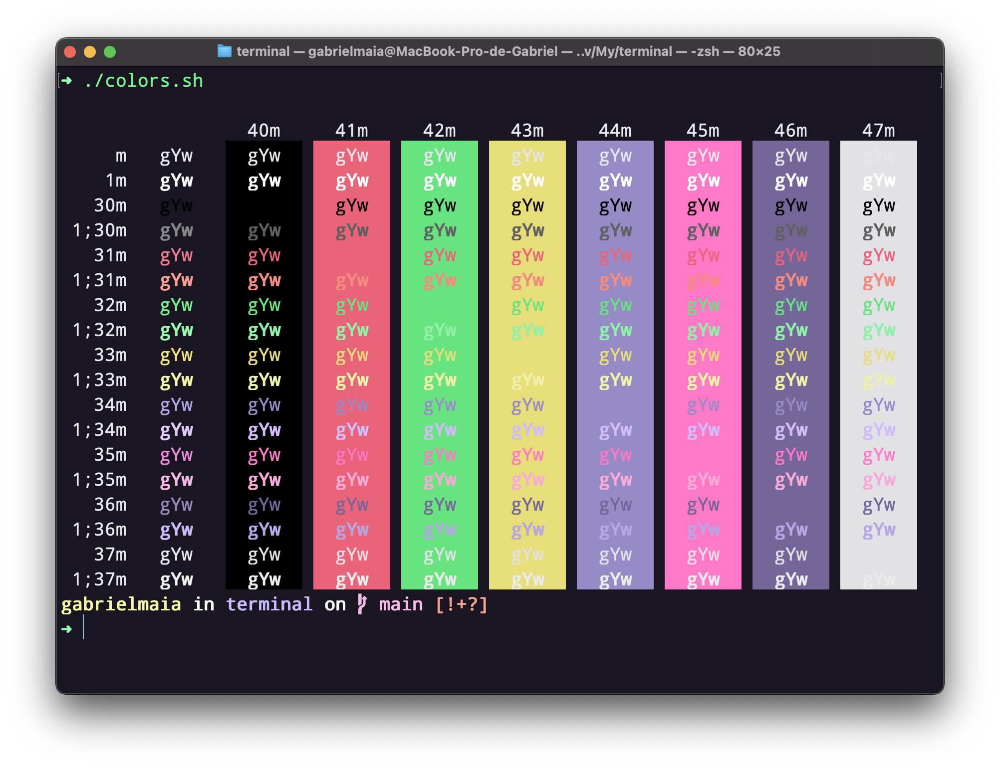

<h1 align="center">
   
  
   
  Omni Owl for <a href="https://www.jetbrains.com">JetBrains</a>
   
</h1>

  <strong>Dark theme for <a href="https://en.wikipedia.org/wiki/Terminal_(macOS)">Terminal.app</a></strong>

  

  

  <a href="#install">Install</a> •
  <a href="#license">License</a>

  

## Install

All instructions can be found at [INSTALL.md](./INSTALL.md).

|  |
|------------------------------------------------------------------------------------------------------------|
| [Gabriel Maia](https://github.com/gabrielmaialva33)                                                             |

## License

[MIT License](./LICENSE.md)
